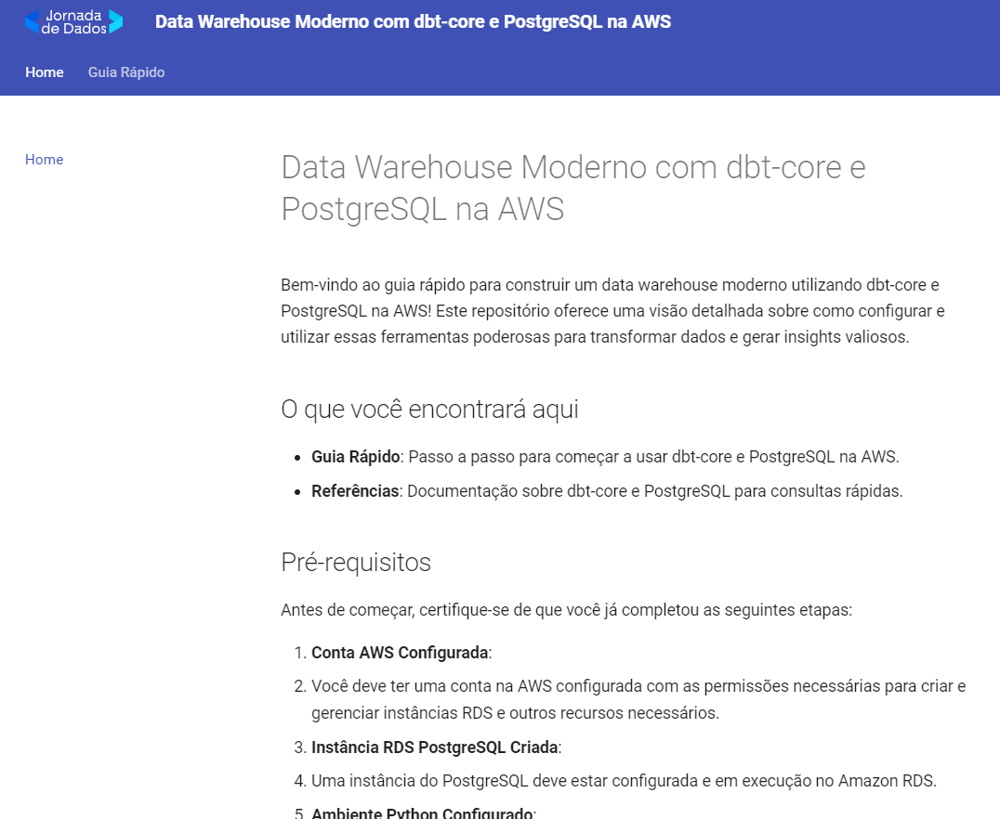

# dbt-core-northwind-project

Projeto de conclusão do bootcamp de SQL e analytics engineer da [Jornada de Dados](www.suajornadadedados.com.br)

## O que é dbt?

O dbt é um workflow de transformação focado em SQL que permite que equipes implementem código analítico de forma rápida e colaborativa, seguindo as melhores práticas de engenharia de software, como modularidade, portabilidade, CI/CD e documentação. Agora, qualquer pessoa da equipe de dados pode contribuir com segurança para pipelines de dados de nível de produção.

[](https://www.getdbt.com/product/what-is-dbt)

## Arquitetura moderna

Esse projeto tem como objetivo apresentar de forma prática uma solução completa de dados aproveitando os principais módulos e funcionalidades do dbt-core.


## Tabela de Conteúdos

- [Introdução](#introdução)
- [Objetivo do Projeto](#objetivo-do-projeto)
- [O que é dbt?](#o-que-é-dbt)
- [Pré-requisitos](#pré-requisitos)
- [Hello World](#hello-world)
  - [1. Clonar o Repositório](#1-clonar-o-repositório)
  - [2. Executar os Contêineres Docker](#2-executar-os-contêineres-docker)
  - [3. Rodar o Primeiro Comando dbt](#3-rodar-o-primeiro-comando-dbt)
  - [4. Gerar e Acessar a Documentação dbt](#4-gerar-e-acessar-a-documentação-dbt)
- [Estrutura do Projeto](#estrutura-do-projeto)
- [Comandos dbt](#comandos-dbt)
- [Contribuição](#contribuição)
- [Exemplos Práticos](#exemplos-práticos)
- [Casos de Uso](#casos-de-uso)

## Introdução

A ferramenta dbt (data build tool) é uma solução inovadora no campo da engenharia de dados, projetada para conectar-se a repositórios de dados centralizados como Data Warehouses e Data Lakes. Ela habilita usuários de negócios, analistas e engenheiros a gerar transformações de dados, regras de negócios e insights valiosos de forma autônoma e eficiente.

## Objetivo do Projeto

O objetivo deste projeto é implementar uma solução de dados que foi inicialmente desenvolvida utilizando um processo padrão no PostgreSQL (criação de tabelas, views, procedures, etc.), mas agora utilizando dbt-core. A proposta é comparar as duas abordagens para evidenciar as vantagens e simplificações que o dbt-core pode oferecer em termos de manutenção, colaboração e escalabilidade das transformações de dados.

## Pré-requisitos

Antes de começar, certifique-se de ter os seguintes softwares instalados em seu sistema:

- [Git](https://git-scm.com/downloads): Para clonar o repositório.
- [Docker](https://www.docker.com/products/docker-desktop): Para executar os contêineres do PostgreSQL, pgAdmin e dbt.
- [Python](https://www.python.org/downloads/): Para rodar scripts auxiliares.

## Hello World

### 1. Clonar o Repositório

Primeiro, clone este repositório para o seu ambiente local usando Git. Abra um terminal e execute o seguinte comando:

```sh
git clone git@github.com:lvgalvao/dbt-core-northwind-project.git
cd dbt-core-northwind-project
```

### 2. Executar os Contêineres Docker

Com o Docker instalado, navegue até o diretório do projeto clonado e execute o seguinte comando para iniciar os contêineres:

```sh
docker-compose up --build
```

Isso iniciará os contêineres necessários: PostgreSQL, pgAdmin, dbt-core.

### 3. Acessar o pgAdmin para visualizar o seu banco

Para acessar o pgAdmin e visualizar os dados, abra seu navegador e vá para:

- URL: `http://localhost:5050/browser/`

Use as seguintes credenciais para se conectar ao banco de dados:

- **Host**: `db`
- **Porta**: `5432`
- **Nome do Banco**: `northwind`
- **Usuário**: `postgres`
- **Senha**: `postgres`

Vamos trabalhar nesse projeto com a base northwind

O dbt é uma ferramenta focada na transformação de dados dentro de um pipeline de ETL/ELT, onde ETL significa Extrair, Transformar e Carregar. Ele se concentra especificamente no aspecto de Transformação (T), permitindo a criação de fluxos de trabalho de transformação de dados usando SQL.


Gaste uns 10 minutos avaliando o seu banco de dados sobre esses pontos

- Quais são minhas tabelas mais importantes?
- Que tipo de KPIs uma empresa dessa precisa?
- Qual a melhor forma de servir esses dados? que tabelas? modelagens?
- Como estruturar um Data Warehouse para garantir:
    1) que a transformação seja compatível com python e sql
    2) tenha versionamento de versão e CI/CD
    3) tenha testes unitários, testes de dados e documentação.

### 4. Rode agora o primeiro comando dbt e veja tudo isso em segundos

Deve ser muito complexo tudo isso, correto?

Mais ou menos

Você está pronto para rodar seu primeiro comando dbt? 

Abra um novo terminal e execute:

```sh
dbt run
```

Esse comando executará todas as transformações definidas nos modelos dbt e você verá a saída dos resultados no terminal.

### 5. Gerar e Acessar a Documentação dbt

Para gerar e acessar a documentação do dbt, execute os seguintes comandos no ambiente local:

```bash
python -m venv .venv
source .venv/Scripts/activate
pip install -r requirements.txt 
```

```sh
dbt docs generate
dbt docs serve --port 8080
```

Abra seu navegador e vá para:

- URL: `http://localhost:8080`

Você verá a documentação interativa gerada pelo dbt.

## Jornada de Dados

Esse projeto faz parte da comunidade de estudo Jornada de dados
Nossa missão é **fornecer o melhor ensino em engenharia de dados**


Se você quer:

1) Construir uma **base sólida** em Python e SQL
2) Aprender as **principais habilidades e ferramentas** de engenharia de dados
3) Criar ou melhorar seu **portfólio** de dados
4) Criar ou aumentar o seu **networking** na área
5) Mudar ou dar o **próximo passo em sua carreira**

A **Jornada de Dados** é o seu lugar

## Veja a documentação completa**:

[](https://lvgalvao.github.io/dbt-core-northwind-project/)