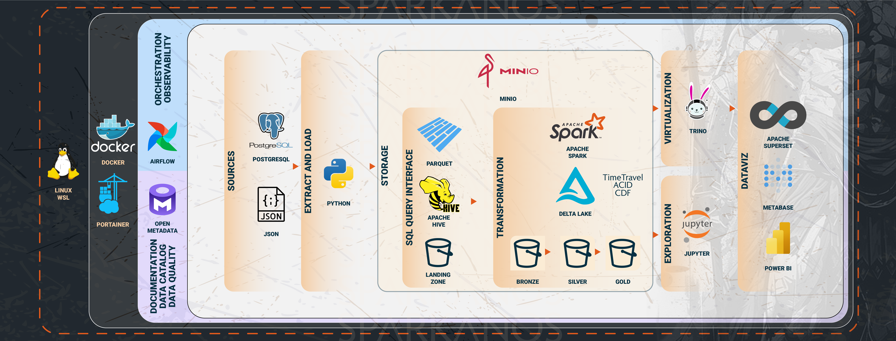

# Welcome to the Data Engineering stack Project! 🎉

## Architecture

We're thrilled to have you on board. Sparkanos is an innovative platform designed to revolutionize the way you approach your projects, with a focus on cutting-edge services, tools, and resources.

## Navigate the Project

To help you get started, here are some key areas you might want to explore:

- [Services](http://170.79.87.98005/services/): Discover the range of services Sparkanos offers to accelerate your progress.
- [Tools](http://170.79.87.98005/tools/): Explore the powerful tools available to streamline your workflow.
- [Tutorials](http://170.79.87.98005/tutorials/): Step-by-step guides and tutorials to help you master Sparkanos.
- [Projects](http://170.79.87.98005/projects/adventureworks/): Dive into ongoing projects or start your own.
- [Support](http://170.79.87.98005/support/): Need help? Find support resources and contact information.

## Data Catalog

For a comprehensive view of the project's end-to-end process, be sure to check out our data catalog. You can access it at [http://170.79.87.98585](http://170.79.87.98585).

## Let’s Get Started

Dive into the Sparkanos ecosystem and unlock the full potential of your projects. If you ever get stuck or need assistance, our [Support](http://170.79.87.98005/support/) team is here to help!

Happy Sparking! ⚡
