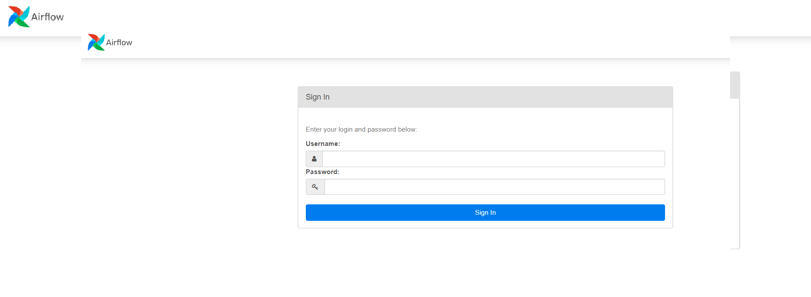

# Airflow

## Run Airflow
### Step 1
```
cd applications/airflow
```
### Step 2
```
sudo docker compose up -d
```

## Credentials Airflow
```
cd applications/airflow
```
file ```secret-airflow.txt```

### Access Airflow
170.79.87.9:8081

sample Airflow UI:

