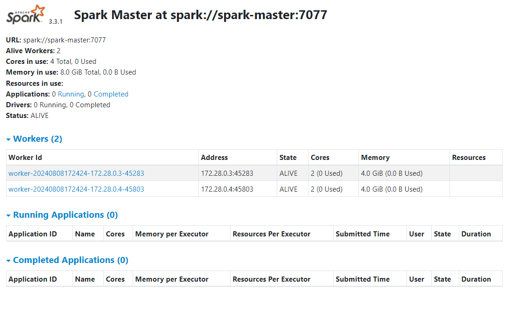
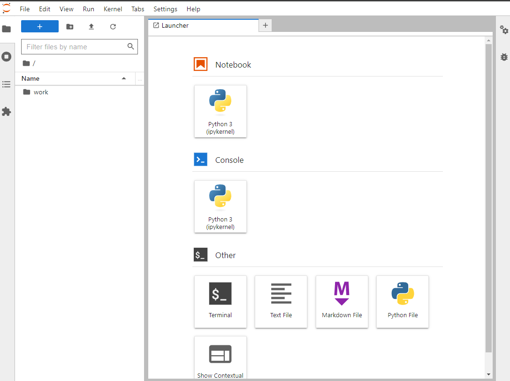
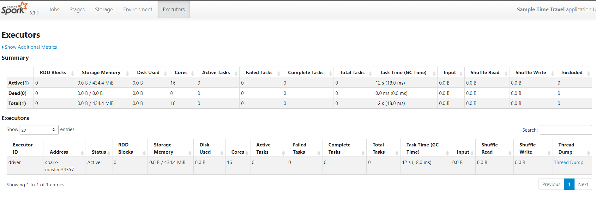

# Spark

## Run Spark
### Step 1
```
cd applications/spark
```
### Step 2
```
sudo docker compose up -d
```

### Access Spark via UI
#### spark UI Cluster

170.79.87.98083 

Sample Spark Cluster UI:


#### Jupyter
170.79.87.98889 

Sample Jupyter:


#### Job running
170.79.87.94040 

Sample job running:
(just when job running)



